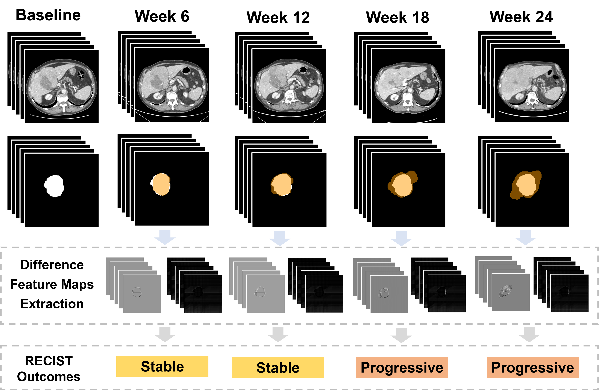

# RECORD
This is the GitHub Repository providing an example code base for "RECIST-guided Consistent Objective Response Evaluation by Deep Learning on Immunotherapy-treated Liver Cancer".



## Getting started
### Dependencies
This project requires Python 3 (3.7.13) with the following additional packages:
* [PyTorch](https://pytorch.org/) (torch==1.11.0, torchvision==0.12.0) with CUDA support
* [monai](https://pypi.org/project/monai/) (0.9.1)
* [NumPy](https://numpy.org/) (1.21.2)
* [tqdm](https://github.com/tqdm/tqdm) (4.64.0)
* [scikit-learn](https://scikit-learn.org/stable/) (0.22.2)
* [matplotlib](https://matplotlib.org/) (3.5.2)
* [pandas](https://pandas.pydata.org/) (2.0.1)
* [TensorBoard](https://pypi.org/project/tensorboard/) (2.5.1)
* [antspyx](https://pypi.org/project/antspyx/) (0.2.0)
* [connected-components-3d](https://pypi.org/project/connected-components-3d/) (3.10.2)
* [nibabel](https://pypi.org/project/nibabel/) (3.2.2)
* [Optimizers](https://pypi.org/project/Optimizers/) (0.1)
* [scipy](https://pypi.org/project/scipy/) (1.7.3)
* [SimpleITK](https://pypi.org/project/SimpleITK/) (2.2.1)

The numbers in parentheses denote the versions used during development of this project. Other python and package versions may or may not work as intended.

A requirements file is provided in the root of this project and can be used to install the required packages via `pip install -r /path/to/requirements.txt`. If the process fails, you may need to upgrade setuptools via `pip install --upgrade setuptools`.

### Try it with example data
To get you started, example data and configuration files are provided. The data can be downloaded from [here](https://zenodo.org/record/6791937). Extract `data.zip` and place the contents into the `data` folder like this:
```
data/
|
|---- image/
|---- label_gt/
|---- mask/
```

data/
|
|---- dif_map/
|---- image/
|---- label_gt/
|---- liver_ants/
|---- mask/
|---- mask_ants/
|---- transformed_ants/
